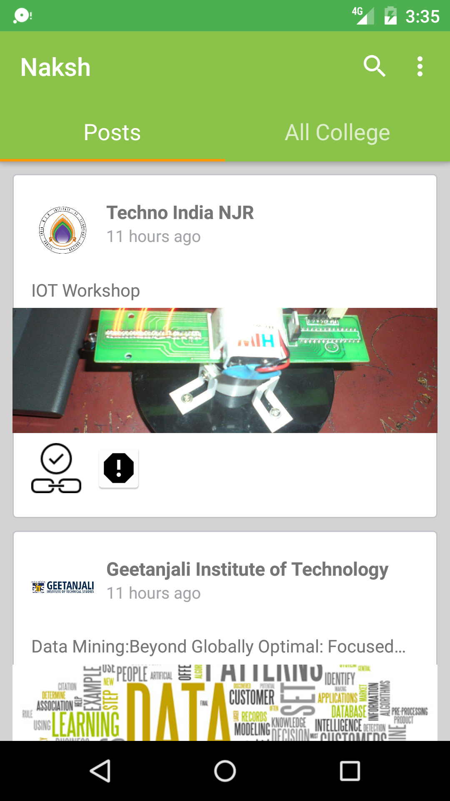
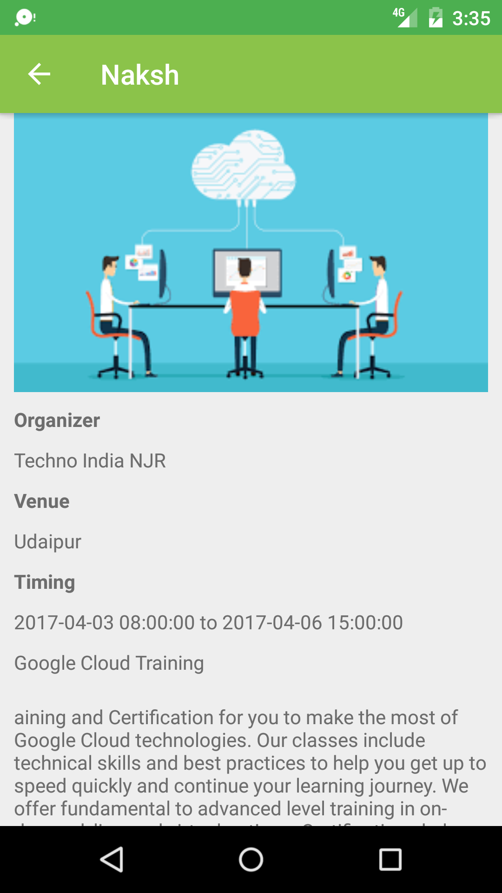
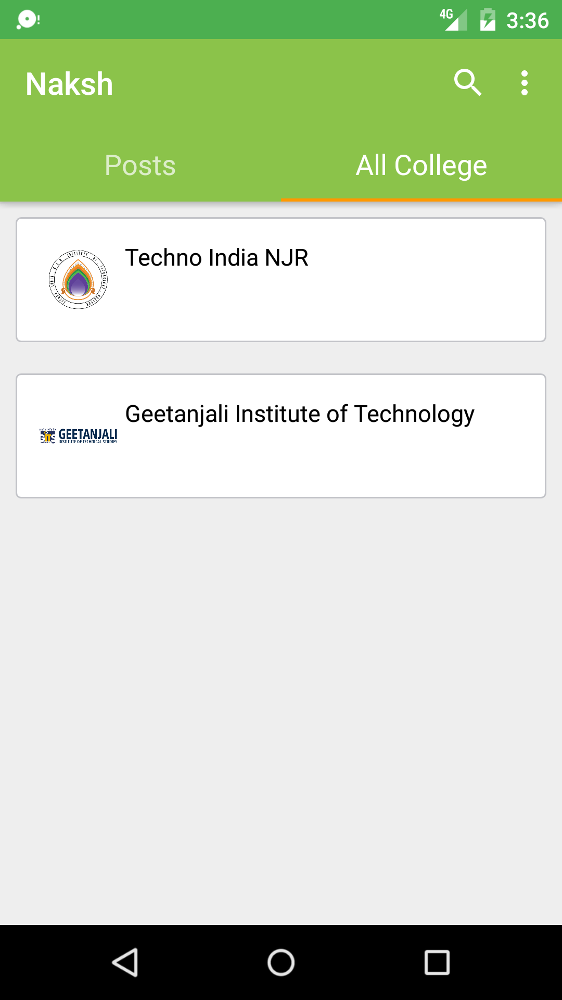
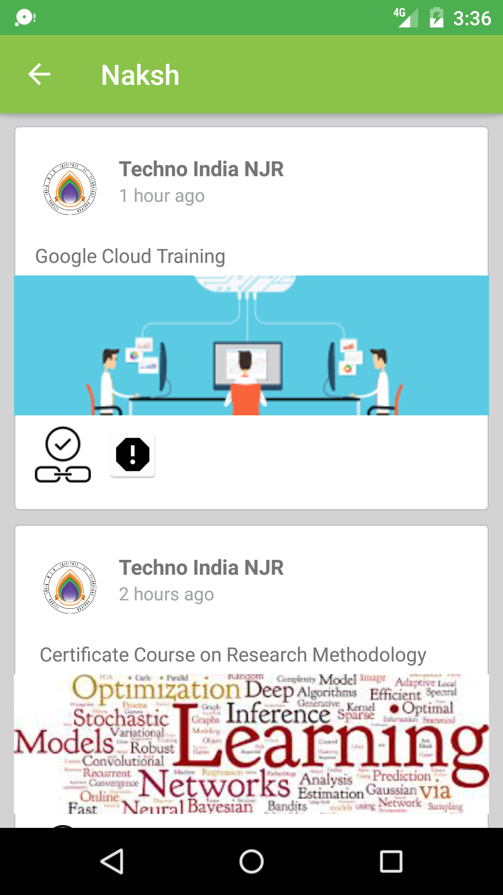
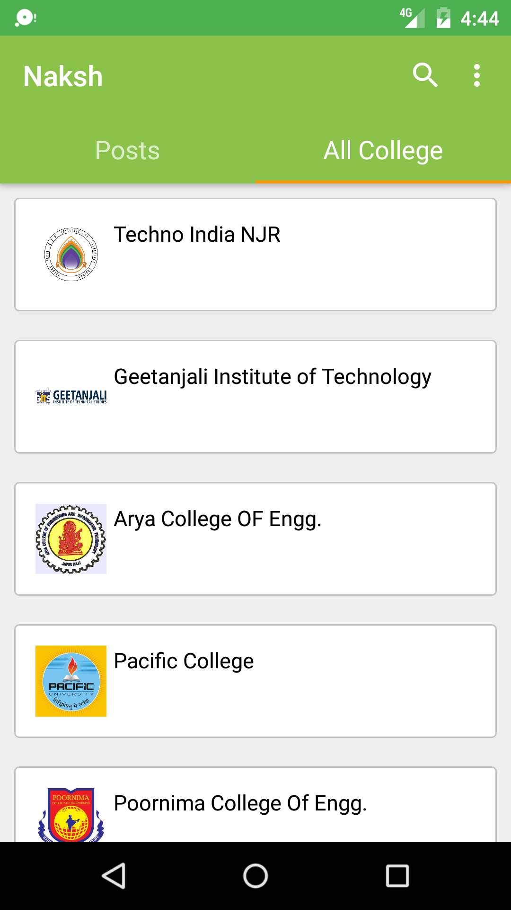
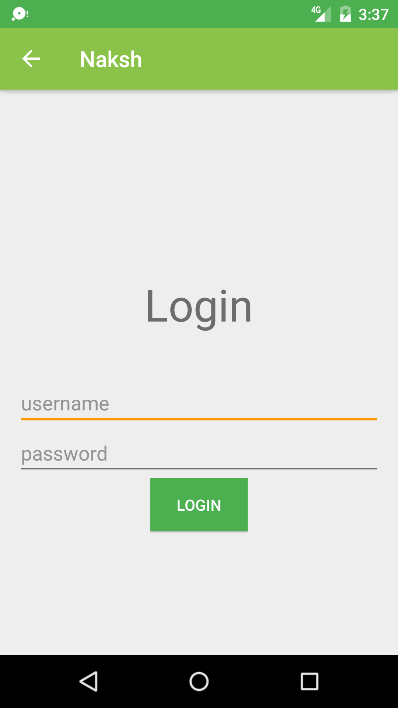

Problem Statement
==================

Lack of information about Academic Activities in single platform
------------------------------------------------------------------------------------

Teachers, students are encouraged to take up research and innovate. Current accreditation, ranking and grading norms emphasises research work and publications by both students and faculty. 
In order to take up research work and subsequently make publications of research findings, to collaborate and network with others who are working on similar problems there is a need to participate in global, national and local workshops, seminars, symposia, conferences, etc. 
Students have to search for information about dates, places and themes of such academic confluences. Lot of time and efforts are wasted in this regard and despite that they may miss out vital information and chance to make presentations.
Availability of single portal will be extremely useful for obtaining the information about all academic activities across the country, universities and international arena in chronological order and in subject areas so as to enable the students, faculty, and researchers to access information and prepare well in advance and participate effectively and successfully

Contributions, Bug Reports, Feature Requests
---------------------------------------------------------

This is an Open Source project and we would be happy to see contributors who report bugs and file feature requests submitting pull requests as well.

### Screenshots of a sample Android app

  

  

